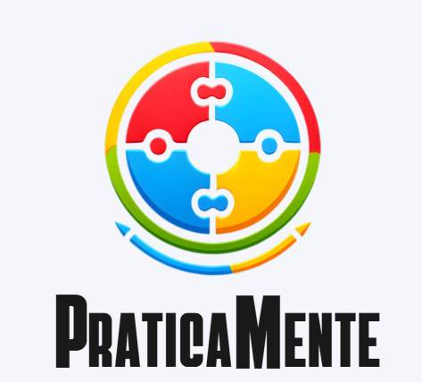

# TEA App - Praticamente



## Sobre o Projeto

O **TEA App (Praticamente)** é um aplicativo móvel desenvolvido para auxiliar crianças no espectro autista, oferecendo uma variedade de jogos educativos e ferramentas de apoio. O objetivo é proporcionar um ambiente lúdico e interativo que estimule o desenvolvimento cognitivo, a comunicação e a aprendizagem de rotinas diárias.

O aplicativo foi construído utilizando React Native com Expo e integra-se com o Firebase para funcionalidades de backend como autenticação e banco de dados.

## ✨ Funcionalidades

O aplicativo conta com uma gama de jogos e funcionalidades pensados para as necessidades de crianças com TEA:

* **Autenticação de Usuários:** Sistema de login e cadastro para pais ou responsáveis, permitindo um ambiente personalizado.
* **Gerenciamento de Dependentes:** Os responsáveis podem cadastrar e gerenciar perfis para as crianças que utilizarão o app.
* **Seleção de Jogos Educativos:** Uma tela principal que oferece acesso a diversos minigames:
    * **Jogo da Memória:** Clássico jogo para estimular a memória e o reconhecimento de padrões.
    * **Sons e Imagens:** Associa sons a imagens correspondentes, auxiliando no desenvolvimento da percepção auditiva e visual.
    * **Reconhecimento de Emoções:** Jogo para ajudar a identificar e nomear diferentes emoções através de expressões faciais.
    * **Rotinas Diárias:** Ajuda a criança a organizar e entender a sequência de atividades do dia a dia.
    * **Labirinto:** Jogo para desenvolver o raciocínio lógico e a coordenação motora.
    * **Sequência Lógica:** Desafia a criança a continuar sequências de objetos, estimulando a lógica e o reconhecimento de padrões.
    * **Caça-Palavras:** Jogo clássico para auxiliar na alfabetização e reconhecimento de palavras.

## 🚀 Tecnologias Utilizadas

O projeto foi construído com um conjunto de tecnologias modernas para o desenvolvimento mobile.

-   **Framework:** React Native com Expo.
-   **Linguagem:** JavaScript (ES6+).
-   **Backend:** Firebase (Authentication, Firestore Database).
-   **Navegação:** React Navigation.
-   **Animações:** Lottie for React Native.
-   **Áudio:** Expo AV para reprodução de sons nos jogos.

## ⚙️ Instalação e Execução

Para rodar este projeto localmente, siga os passos abaixo.

### Pré-requisitos
-   Node.js (versão LTS recomendada)
-   Yarn ou npm
-   Expo Go app no seu smartphone ou um emulador Android/iOS configurado.

### Passos

1.  **Clone o repositório:**
    ```bash
    git clone [https://github.com/lmoura00/teaapp.git](https://github.com/lmoura00/teaapp.git)
    cd teaapp
    ```

2.  **Instale as dependências:**
    ```bash
    npm install
    # ou
    yarn install
    ```

3.  **Configure o Firebase:**
    -   Crie um projeto no [Firebase Console](https://console.firebase.google.com/).
    -   Habilite a Autenticação (E-mail/Senha) e o Firestore Database.
    -   Obtenha as credenciais de configuração do seu projeto para a web.
    -   Renomeie o arquivo `firebaseConfig.js.example` (se houver) para `firebaseConfig.js` e preencha com as suas credenciais.

4.  **Inicie o servidor de desenvolvimento:**
    ```bash
    npx expo start
    ```

5.  **Execute no seu dispositivo:**
    -   **No seu smartphone:** Baixe o aplicativo Expo Go na App Store ou Google Play e escaneie o QR code que aparecerá no terminal.
    -   **No emulador:** Pressione `a` para o emulador Android ou `i` para o simulador iOS no terminal onde o Expo está rodando.

## 📂 Estrutura do Projeto

O código-fonte está organizado da seguinte maneira para facilitar a manutenção e o desenvolvimento:
teaapp/
```
├── android/            # Arquivos de configuração específicos para Android
├── ios/                # Arquivos de configuração específicos para iOS
├── src/
│   ├── Assets/         # Imagens, sons e animações Lottie
│   ├── Hooks/          # Hooks customizados (ex: Auth.jsx)
│   ├── Pages/          # Telas principais e jogos do aplicativo
│   ├── Routes/         # Configuração da navegação (React Navigation)
│   └── images/         # Imagens da interface principal
├── App.js              # Ponto de entrada principal do app
├── app.json            # Configurações do projeto Expo
├── babel.config.js     # Configuração do Babel
├── firebaseConfig.js   # Configuração do Firebase
└── package.json        # Dependências e scripts do projeto
```
